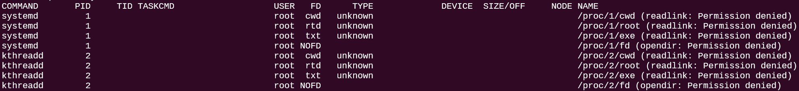

おうち K8s に入門したので監視にまつわるコマンドを使っていくことになりました。  そのためここらで監視にまつわる Linux コマンドを学ぼうと思います。

## lsof コマンド
`lsof` は List Open Files の略です。その名の通りプロセスが開いているファイルに関する情報を出力してくれるコマンドです。Linux はすべてファイルなので、Open しているファイルなら実質なんでも見れちゃいます。

`lsof` コマンドを実行すると以下のような情報が出ます。


- `COMMAND`: プロセス名
- `PID`: プロセス ID
- `USER`: プロセスを実行しているユーザ名
- ...
- `NAME`: 開いているファイル名

`lsof -c` を使えば特定のプロセスが開いているファイルを確認できます。`-c` は COMMAND の c で、プロセス名を指定するオプションです。

ということはプロセスID で絞り込みたければ `-p` オプションを使えば良いわけですね。

また `-i` オプションを使えばネットワーク接続に関する情報を確認できます（`-i` は internet の i）。例えばこのブログは Hugo で動いているので、`hugo` プロセスが開いているネットワーク接続を確認するには以下のようにします。

```bash
lsof -c hugo -i
```

また `-i:<ポート番号>` とすれば特定のポート番号に関する情報を確認できます。  
Hugo は 1313 番ポートを使っているので以下のコマンドを実行すれば OK です。

```bash
lsof -i:1313

COMMAND   PID  ...
hugo    34170  ...
```

プロセス ID が分かったので止めることだって可能です。

```bash
kill 34170
```

## 終わりに
監視にまつわるコマンドを学ぶたびに更新します。