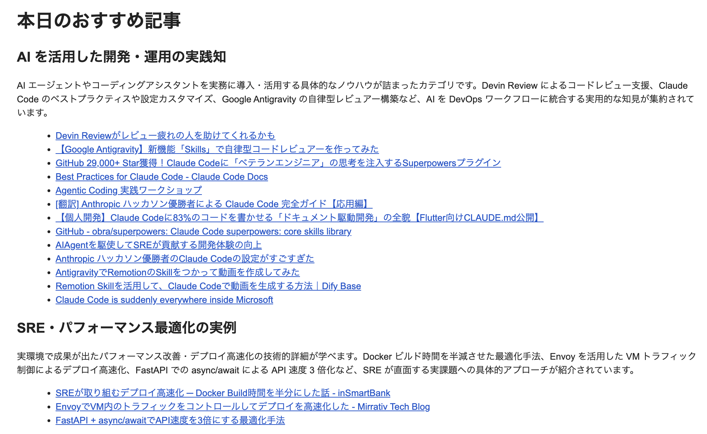

タイトルの通りですが、RSSを要約して毎朝メールを送る仕組みを作りました。  
情報収集が捗って非常にいい感じです。

リポジトリはこちら。  
https://github.com/a-takamin/summarize-rss

## 背景
もともと Feedly という RSS リーダーを使っていましたが、AI が簡単に扱えるようになってからは要約したい気持ちが高まるばかり。

そこで 「OSS の RSS リーダーを立てたら自分で AI 触り放題じゃないか」と考えたのが始まりです。

## 仕組みの全体像
以下のような流れで動く非常に簡単な構成です。  
コーディング AI を使いつつ 1, 2 日の空いた時間でササッと作れました。

1. FreshRSS の API を叩いて記事を取得
   1. おうち K8s の cronjob で動かしています
2. 記事のタイトルを Amazon Bedrock に送信してカテゴライズ + コメント
3. 結果を Amazon SES を使って自分に配信

こんな感じのメールが毎朝届きます。

### 作ってみて
非常に便利です。  

まず、メールが送られてくるので日々のキャッチアップ活動を忘れることがありません。  
※特に自分はメールを 0 件にしておきたいタイプなので。

またこれのおかげで connpass の新着イベントの定員が埋まる前に申し込めるなと気付きました。  
もっと本気で枠を狙うならリアルタイム処理が必要そう。

今は技術ブログしか購読していませんが、例えばニュース記事や町のイベントなどにも活用できそうです。

プロンプト管理ツールを使って外部注入できると素敵だなとは思っています。

### プロンプトについて
一応、RSS のフォルダごとにプロンプトを替えられるようになっています。  
例えば「connpass の新着イベント」と「Zenn のトレンド」に対して処理を少し変えられます。

### おうちK8sについて
`Cronjob` という `kind` を知れて良かったです。  
`Timezone` を指定しても `UTC` で動いてしまったので諦めて `UTC` で指定していますがあれはなんだったのか。

後は K8s の世界でシークレット（AWS認証情報など）を使ったので、その管理について触れる機会となったのも良かったですね。  

まぁただ今回は結局手動で `Secret` リソースを `apply` する形式を取りました。`Sealed Secret` という仕組みがありますが、ちゃんと理解せぬまま public リポジトリで使うのが怖く、動くものが欲しいとスピードを重視したためですね。

今後 `Vault` やその他クラウド上に管理するのが良いなと思います。

後は `ArgoCD` を初めて使ったのでその概念や書式に触れたのも良かったです。  
アプリケーションは `ArgoCD` の管理単位であって必ずしもアプリケーションとは限らないぞ。

### 料金について
使うモデルによりますが、1ヶ月 1000 円くらいですかね…？  
今は `Claude 4.5 Sonnet` を使っていてプロンプトも適当なので、節約の余地はまだあると思います。もちろん `Bedrock` のこだわりもないです。

本当は記事の総合的な要約ができると嬉しいのですが、流石にトークン量が多くなるので。  

あまり高くなると、今度は商用アプリの課金で良いのでは（それこそ Feedly など）となるのでそこのバランスは取っていきたいですね。

### FreshRSS の API について
思うことがありすぎる。
Google Reader という 2013 年にサ終したアプリとの互換性を保った API を扱うのですが、いかんせん古すぎてまともな API 定義が見当たらない…。

AI も駆使して断片的な情報を集め、とりあえず必要そうな API だけは使えるようになりました。

### 注意点
取りあえず動くものが欲しく Vibe Coding でサッと作ったため、色々と不足しているので注意が必要です。  
例えばシークレット管理は手動ですし、プロンプトとベタっと書いたままです。

ディレクトリ構造も統一感ないですね（分割粒度がバラバラだったり、IF が切られていたりいなかったり）。

逆に言うとこのあたりの改善でまたおうち K8s で遊べて素敵ですね（？）。

## 終わりに
おうち K8s の勉強にもなって、情報も収集できて、一石二鳥でした。  
これからも愛を込めてプロダクトを育てていきます。
